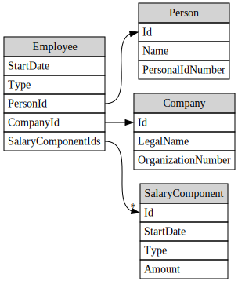

# SalaryImport

## Data Model



### Annual Salary

| ComponentType | Action         |
|---------------|----------------|
| "1"           | Multiply by 12 |
| *             | Ignore         |

### Pensionable Salary

| EmploymentType | Action                                     |
|----------------|--------------------------------------------|
| "A"            | ComponentType "1" * 12,2                   |
| "B"            | ComponentType "2" * 12 + ComponentType "3" |
| *              | Ignore                                     |

### Calculation assumptions

* Employee StartDate has not been taken into account in calculation
* Annual salary may be zero if salary component of type 1 were given to an 
  employee at a later point in time than other components

### Output format

The output format used is comma-separated with the columns:

Employee name, annual salary, pensionable salary, date of salary change

### Import format

The import file format is defined by the JSON schema [provided](assets/importfile-schema.json).
Test files are found in the [assets](assets/) directory.

## Build, test and run

Use the scripts that are located in the root directory of the solution to build,
to run the tests and to run the application.

```
$ ./build.sh
$ ./test.sh 
```

The build script and the application targets win10 and osx and is configured to
do a self-contained deployment which means that the build output will contain an
executable (.exe on win10) that can be run from the console.
The run.sh/.cmd scripts calls the built executables from the output directory.

Running the application without any arguments will print the results of the pre-
defined data.

```
$ ./run.sh
Anna,384000,390400,2014-03-01
Bertil,480000,488000,2012-05-01
Cecilia,0,360000,2014-07-01
Cecilia,0,364000,2014-09-17
Cecilia,612000,364000,2015-07-01
David,0,8000,2014-03-01
David,336000,8000,2014-03-15
David,336000,452000,2015-08-01
David,336000,488000,2016-03-01
Emma,492000,500200,2011-10-12
```

The application takes the files to import as its arguments, see `./run.sh --help`.
The following example imports two files from the [assets](assets/) directory:

```
$ ./run.sh ./assets/AnnaGetsARaise.json ./assets/EverybodyGetsARaise.json
Successfully imported file './assets/AnnaGetsARaise.json'
Anna,384000,390400,2014-03-01
Anna,960000,976000,2016-01-01
Bertil,480000,488000,2012-05-01
Cecilia,0,360000,2014-07-01
Cecilia,0,364000,2014-09-17
Cecilia,612000,364000,2015-07-01
David,0,8000,2014-03-01
David,336000,8000,2014-03-15
David,336000,452000,2015-08-01
David,336000,488000,2016-03-01
Emma,492000,500200,2011-10-12
Successfully imported file './assets/EverybodyGetsARaise.json'
Anna,384000,390400,2014-03-01
Anna,960000,976000,2016-01-01
Anna,1200000,1220000,2017-01-01
Bertil,480000,488000,2012-05-01
Bertil,1200000,1220000,2017-01-01
Cecilia,0,360000,2014-07-01
Cecilia,0,364000,2014-09-17
Cecilia,612000,364000,2015-07-01
Cecilia,1200000,364000,2017-01-01
David,0,8000,2014-03-01
David,336000,8000,2014-03-15
David,336000,452000,2015-08-01
David,336000,488000,2016-03-01
David,1200000,488000,2017-01-01
Emma,492000,500200,2011-10-12
Emma,1200000,1220000,2017-01-01
```